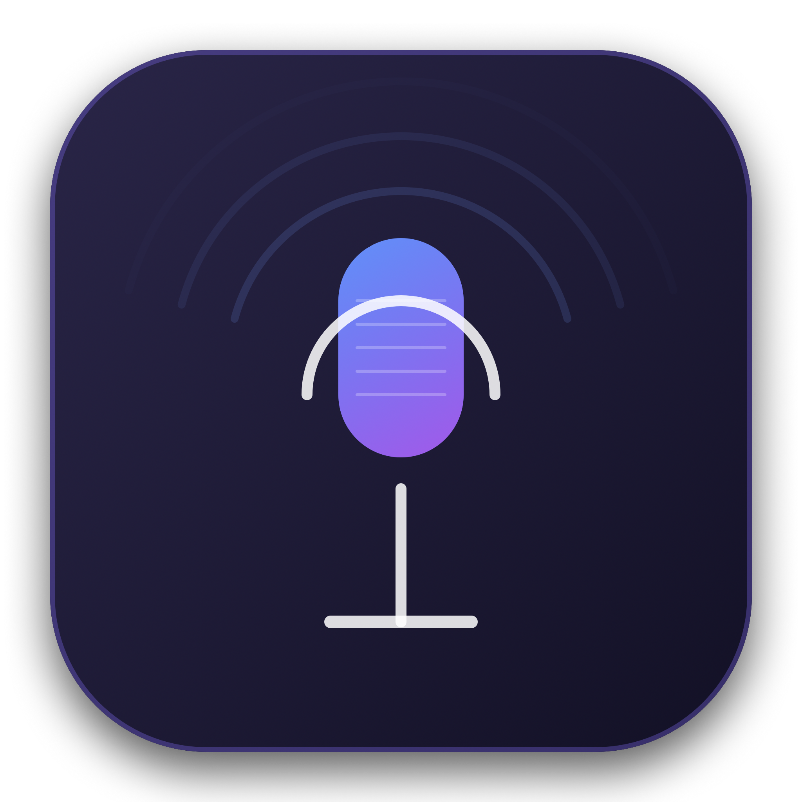

# HardyFlow 🎙️⚡

<p align="center">
  
</p>

<p align="center">
  <strong>Universal Real-Time Speech-to-Text Dictation for macOS.</strong><br>
  <em>100% Free, Completely Private, Apple Silicon Optimized, Multi-Locale & Indian Accent Tuned.</em>
</p>

<p align="center">
  
  
  
  
  
</p>

---

## 📖 Overview

**HardyFlow** is an open-source, production-ready macOS menu bar utility designed for frictionless, real-time voice-to-text dictation across every application on your Mac (Google Chrome, Slack, VS Code, Notes, Notion, Mail, WhatsApp, Discord, Terminal, and more).

Unlike cloud-dependent commercial alternatives that charge monthly subscriptions or require OpenAI API tokens, HardyFlow runs directly on your Mac using Apple's high-speed speech recognition neural engine and CoreAudio taps. It requires **zero API keys**, costs **nothing**, respects **100% privacy** by never saving audio to disk, and features instant voice mistake removal with **"No No No"** and hands-free activation with **"Hey Hardy"**.

---

## ✨ Key Features

### ⚡ Universal Dictation into Any macOS App
- Dictate fluidly into any text field, editor, or browser input across your entire system.
- Simply activate the mic, speak naturally, and watch your words stream live.
- Restores focus to your target application and pastes your transcription directly via synthetic `Command + V`.

### 💸 100% Free, Native & Offline-Capable
- Built 100% natively in Swift using Apple's native `Speech` (`SFSpeechRecognizer`) and `AVFAudio` (`AVAudioEngine`) frameworks.
- No OpenAI / Whisper API keys, no subscription paywalls, no monthly token limits, and zero operational fees.
- Leverages Apple Silicon Neural Engine for ultra-low latency on-device dictation.

### 🔒 Zero Audio Persistence & In-Memory Purging (Privacy-First)
- **Zero Disk Audio**: HardyFlow never writes, saves, or caches any `.wav`, `.caf`, `.m4a`, or audio file to your Mac's filesystem.
- **Ephemeral RAM Taps**: Microphone audio is streamed solely through transient `AVAudioPCMBuffer` memory taps.
- **Immediate Memory Purge**: The moment you click **Stop Listening**, complete dictation, or quit the app, all audio buffer delegates, queues, and transcribed text caches are purged from memory immediately.

### 🌐 Multi-Locale & Indian Accent Optimization
- Specifically calibrated for **Indian English (`en-IN`)**, **Hindi (`hi-IN`)**, and regional diction.
- Primed with domain vocabularies so words like *"popup"* are never mistaken for *"papa"*.
- Built-in support for **62+ worldwide locales**, including:
  - 🇮🇳 English (India) & Hindi (`hi-IN`)
  - 🇺🇸 English (United States)
  - 🇬🇧 English (United Kingdom)
  - 🇨🇦 English (Canada)
  - 🇦🇺 English (Australia)
  - 🇪🇸 Spanish, 🇫🇷 French, 🇩🇪 German, 🇯🇵 Japanese, and more.
- Quick one-click accent switcher directly in the HUD header.

### 🗣️ Real-Time Voice Mistake Removal ("No No No")
- Say **"No No No"** (or *"No No No Remove"*) while speaking to excise the command and immediately erase the preceding word from your dictation buffer.
- Saying it multiple times (e.g., *"no no no no no no"*) backtracks and removes multiple preceding words.
- Accompanied by a subtle audio pop sound effect and an animated visual badge in the HUD.

### 👂 Hands-Free "Hey Hardy" Always-On Wake Word
- Enable ambient background listening to start dictating completely hands-free whenever you say **"Hey Hardy"** (or *"Hi Hardy"*, *"OK Hardy"*, *"HardyFlow"*).
- Automatically detects natural pauses in speech and triggers auto-paste after configurable silence.

### 🪟 Interactive Floating Glassmorphic HUD
- **Centered 15-Bar Soundwave**: Dynamic real-time RMS visualizer reacting fluidly to microphone volume.
- **⏹ Stop Listening Button**: Stop microphone input immediately with a single click.
- **Full-Width Editable Text Area**: Click inside the text box at any time to manually backspace words, correct typos, or add custom edits before delivery.
- **Movable Anywhere**: Click and drag anywhere across the top header bar to position the card across your monitors.
- **Smooth Corner Resizing**: Fluid ProMotion corner grabber allows resizing from `420 x 180` up to `850 x 600`.
- **Draggable Text Chip**: Drag and drop your transcribed text directly into any external window or chat input.

### 🎛️ Menu Bar & Comprehensive Preferences
- Sleek `NSStatusItem` menu bar controller with animated microphone status indicators (`Rec`, `👂 Listening`, `Pasting`, `Ready`).
- 4-tab Preferences panel for Hotkeys, Wake Word toggles, Silence Timeouts (1.0s – 4.0s), Output Modes, and macOS Security & Privacy permissions.

---

## 🛠️ Technology Stack & Architecture

HardyFlow is architected cleanly with Swift 6 and modular Swift Package Manager (SPM) targets:

```
projects/wisperflow/
├── Package.swift                                      # Swift Package Manager manifest
├── .gitignore                                         # Git exclusions for build artifacts
├── README.md                                          # Documentation & guides
├── Resources/
│   ├── AppIcon.icns                                   # Custom macOS squircle application icon
│   ├── app_logo.png                                   # High-resolution 1024x1024 icon
│   └── HardyFlow.entitlements                         # Microphone, Speech & Apple Events entitlements
├── Sources/
│   ├── HardyFlowCore/                                 # Business Logic & Audio Subsystems
│   │   ├── AudioEngineManager.swift                   # AVAudioEngine tap, 48kHz Float32 input, RMS metering
│   │   ├── SpeechRecognitionService.swift             # SFSpeechRecognizer streaming & contextual vocabulary
│   │   ├── VoiceCommandProcessor.swift                # Real-time 'No No No' token backtracking parser
│   │   ├── WakeWordDetector.swift                     # Ambient 'Hey Hardy' continuous acoustic detector
│   │   ├── PasteService.swift                         # Focus tracking & Quartz CGEvent synthetic Cmd+V dispatch
│   │   ├── HotkeyManager.swift                        # Carbon EventHotKey (Option + Space) listener
│   │   ├── SoundManager.swift                         # Audio cues (Glass, Bottle pop, Tink, Basso)
│   │   └── AppState.swift                             # Central Combine state store & persistence
│   ├── HardyFlowUI/                                   # SwiftUI & AppKit User Interface
│   │   ├── FloatingHUDWindowController.swift          # Borderless floating key NSPanel controller
│   │   ├── FloatingHUDView.swift                      # Glassmorphic HUD, full-width editor, controls
│   │   ├── AudioWaveformView.swift                    # 15-bar symmetrical animated audio waveform
│   │   ├── WindowDragHandle.swift                     # AppKit mouse tracking for window drag & corner resize
│   │   ├── DraggableTextChip.swift                    # macOS Drag & Drop item provider chip
│   │   ├── StatusBarController.swift                  # NSStatusItem with dynamic mic state & menus
│   │   └── PreferencesView.swift                      # 4-tab Settings window & permissions auditor
│   ├── HardyFlow/                                     # Main Application Target
│   │   ├── AppDelegate.swift                          # Lifecycle, accessory activation, hotkey binding
│   │   └── main.swift                                 # NSApplication entrypoint
│   └── HardyFlowTestRunner/                           # Verification Test Suite
│       └── main.swift                                 # 26 automated unit tests for voice commands, privacy, & locales
└── scripts/
    ├── generate_icon.swift                            # Icon generator using CoreGraphics & iconutil
    └── build_app.sh                                   # Release compilation, .app bundle packager, & codesign
```

### Technologies Used
| Component | Technology | Role |
| :--- | :--- | :--- |
| **Language** | Swift 6 / 5.9 | Type-safe, concurrent, modern systems programming |
| **Speech Engine** | `Speech.framework` (`SFSpeechRecognizer`) | Streaming on-device acoustic recognition & language models |
| **Audio Capture** | `AVFAudio` (`AVAudioEngine`, `AVAudioPCMBuffer`) | 48kHz audio buffer tapping, intelligent hardware routing, RMS metering |
| **App Shell & Panel** | `AppKit` (`NSPanel`, `NSStatusBar`, `NSWorkspace`) | Non-activating floating overlay, status item, focus restoration |
| **User Interface** | `SwiftUI` + AppKit Hybrid | Modern glassmorphism, spring animations, dynamic waveforms |
| **Global Hotkey** | `Carbon.HIToolbox` (`RegisterEventHotKey`) | Low-level OS-wide `Option + Space` keystroke listener |
| **Keystroke Delivery**| `CoreGraphics` (`CGEvent`) | Direct synthetic `Cmd + V` keystroke injection |
| **State Management** | `Combine` (`ObservableObject`, `@Published`) | Reactive data bindings across subsystems |

---

## ⌨️ Shortcuts & Voice Commands

| Action | Trigger | Description |
| :--- | :--- | :--- |
| **Toggle Dictation** | `⌥ Space` (Option + Space) | Press to start listening; press again to finish and paste. |
| **Cancel Dictation** | `Esc` or click `✕` in HUD | Cancels recording immediately without pasting. |
| **Stop Listening** | Click `⏹ Stop Listening` | Immediately halts the microphone and stops listening. |
| **Voice Mistake Removal** | Say `"No No No"` | Excises the phrase and erases the preceding word from speech. |
| **Hands-Free Wake Word** | Say `"Hey Hardy"` | Automatically starts dictation when wake word mode is active. |
| **Drag & Drop** | Drag HUD Chip | Drag transcribed text chip directly into any target window. |

---

## 🚀 Getting Started

### Prerequisites
- macOS 14.0 (Sonoma) or later (Apple Silicon M1/M2/M3/M4 or Intel).
- Xcode 15+ or Swift 5.9+ Command Line Tools.

### 1. Clone the Repository
```bash
git clone https://github.com/jatinsaini6228/hardyflow.git
cd hardyflow
```

### 2. Run the Automated Test Suite
Verify that all 26 unit tests pass:
```bash
swift run HardyFlowTestRunner
```

### 3. Build & Install the Application Bundle
Execute the build and packaging script:
```bash
bash scripts/build_app.sh
```
This script will:
1. Compile HardyFlow in release mode with optimizations.
2. Assemble the macOS Application Bundle (`HardyFlow.app`).
3. Embed icons and generate `Info.plist` with microphone and accessibility permissions.
4. Apply macOS code signature with entitlements.
5. Install `HardyFlow.app` to `/Applications/HardyFlow.app`.

### 4. Launch HardyFlow
```bash
open /Applications/HardyFlow.app
```

---

## 🔒 Permissions & Security

When first launched, HardyFlow prompts for required macOS permissions in the Preferences window:
1. **Microphone**: Needed to capture spoken voice. No audio is ever stored or transmitted.
2. **Speech Recognition**: Handled on-device by Apple's speech recognition neural models.
3. **Accessibility**: Used by `PasteService` to synthesize `Command + V` into your frontmost active window. (Grant under *System Settings → Privacy & Security → Accessibility*).

---

## 📄 License

This project is licensed under the [MIT License](LICENSE).
